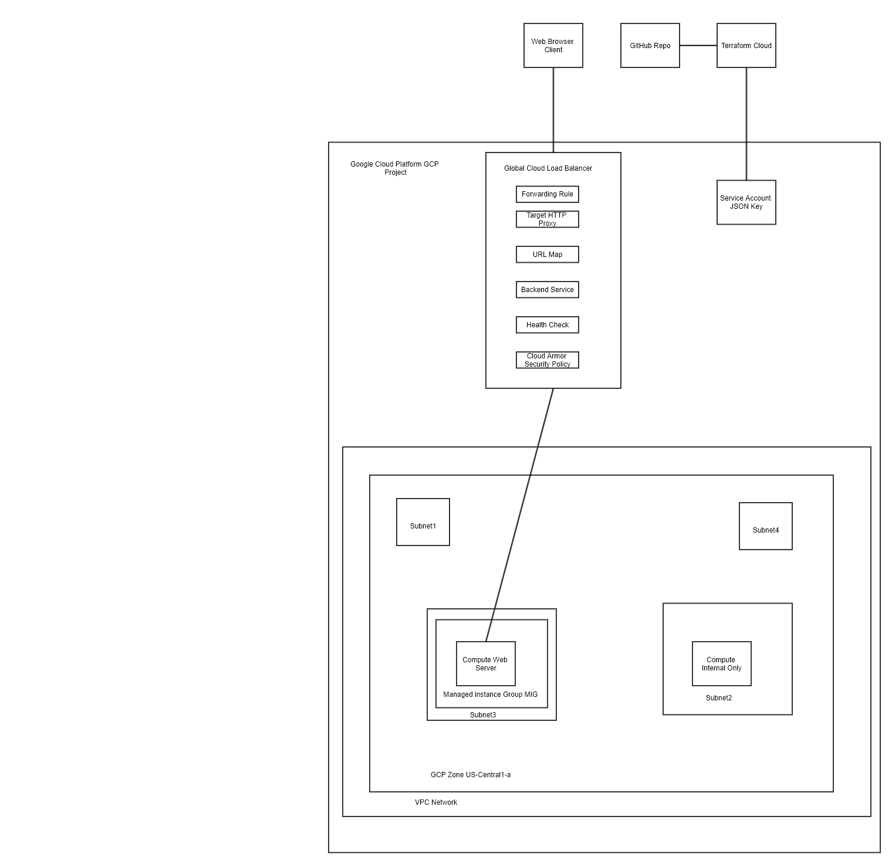
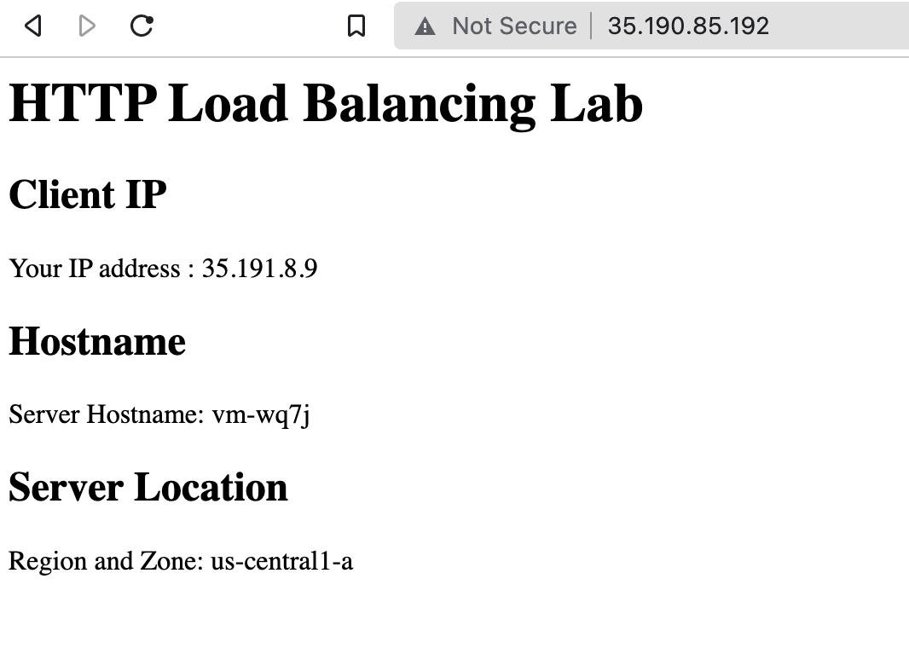

# iac-demo-gcp
- This repo URL is: https://github.com/ibenrodriguez/iac-demo-gcp
- Demo repo with Terraform code to make a RedHat Linux Compute Virtual Machine on Google Cloud Platform
- Need to update the following processes to work with terraform cloud workspaces…
- GitHub - hashicorp/terraform-provider-google: Terraform Google Cloud Platform provider



## ToDo list
- add https with letsencrypt https://bitrock.it/blog/lets-encrypt-with-terraform.html
- integrate with ansible for startup scripts https://docs.ansible.com/ansible/latest/scenario_guides/guide_gce.html

# GCP Edition
- Getting started with Terraform on Google Cloud  |  Google Cloud Platform Community 
- GitHub - terraform-google-modules/terraform-google-bootstrap: A module for bootstrapping Terraform usage in a new GCP organization.
- terraform-google-modules/terraform-google-bootstrap 
- Find, Document, and test the terraform code to build and destroy the following:

# Requirements
1. GCP account
   1. GCP Project
   2. https://console.cloud.google.com/apis/api/compute.googleapis.com/metrics?project=iben-gcp
   3. Be sure the Compute API is enabled or Terraform will throw an error: 
2. GCP Service Account
   1. JSON key stored in Terraform Cloud Sensitive Environment Variable 
3. Terraform Cloud Account
   1. Workspace: Variables | IaC_Demo_GCP | Terraform Cloud https://app.terraform.io/
4. GitHub Repo
5. Startup Scripts located on Public Repo for URL MetaData
6. Example Company Name: VZXY
7. Use smallest machine type that provides sufficient performance. With smallest machine the boot time can be over 20 minutes to run the metadata startup script
   1. Machine types for common workloads, optimized for cost and flexibility
8. Example CLI GCP SDK for VM creation:
```
gcloud compute instances create instance-1 --project=iac-demon --zone=us-central1-a --machine-type=f1.micro --network-interface=network-tier=PREMIUM,subnet=default --maintenance-policy=MIGRATE --service-account=jlkjlkjlkjlk-compute@developer.gserviceaccount.com --scopes=https://www.googleapis.com/auth/devstorage.read_only,https://www.googleapis.com/auth/logging.write,https://www.googleapis.com/auth/monitoring.write,https://www.googleapis.com/auth/servicecontrol,https://www.googleapis.com/auth/service.management.readonly,https://www.googleapis.com/auth/trace.append --create-disk=auto-delete=yes,boot=yes,device-name=instance-1,image=projects/debian-cloud/global/images/debian-10-buster-v20220310,mode=rw,size=10,type=projects/iac-demon/zones/us-central1-a/diskTypes/pd-balanced --no-shielded-secure-boot --shielded-vtpm --shielded-integrity-monitoring --reservation-affinity=any
```
# List of resources to be created:
 1. Project
    1. Service Account
 1. 1 VPC with 4 subnets
    1. Sub1 – 10.0.0.0/24 (should be accessible from internet)
    1. Sub2 – 10.0.10.0/24 (should be accessible from internet)
    1. Sub3 – 10.0.20.0/24 (should NOT be accessible from internet)
    1. Sub4 – 10.0.30.0/24 (should NOT be accessible from internet)
 1. 1 compute instance running RedHat in subnet sub1
    1. 20 GB storage
    1. Install HTTP load testing tools Siege, nmap, and iperf3
 1. 1 compute instance running RedHat in subnet sub3
    1. 20 GB storage
    1. Script the installation of apache on this instance
 1. 1 Layer 7 Load Balancer that listens on port 80 and forwards traffic to the instance in Sub3
 1. External Load Balancer with Cloud Armor
    1. Choosing a load balancer  |  Load Balancing  |  Google Cloud 
    1. Can't use ILB as Cloud Armor WAF is not supported terraform-google-modules/terraform-google-lb-internal 
 1. 1 cloud native WAF solution to protect the workload you just deployed, 
 1. terraform-provider-google/main.tf at main · hashicorp/terraform-provider-google · GitHub
 
 Document any configuration or policy that is enabled

# Notes used for reference
1. https://cloud.google.com/compute/docs/troubleshooting/vm-startup

# Output Example
NOTE: The machine startup process can take up to 10 minutes to complete depending on the specs. 

## HTTP Load Balancing Lab
## Client IP

Your IP address : - http://34.111.225.89/

## Hostname
Server Hostname: vm-wq7j

## Server Location
Region and Zone: us-central1-a



